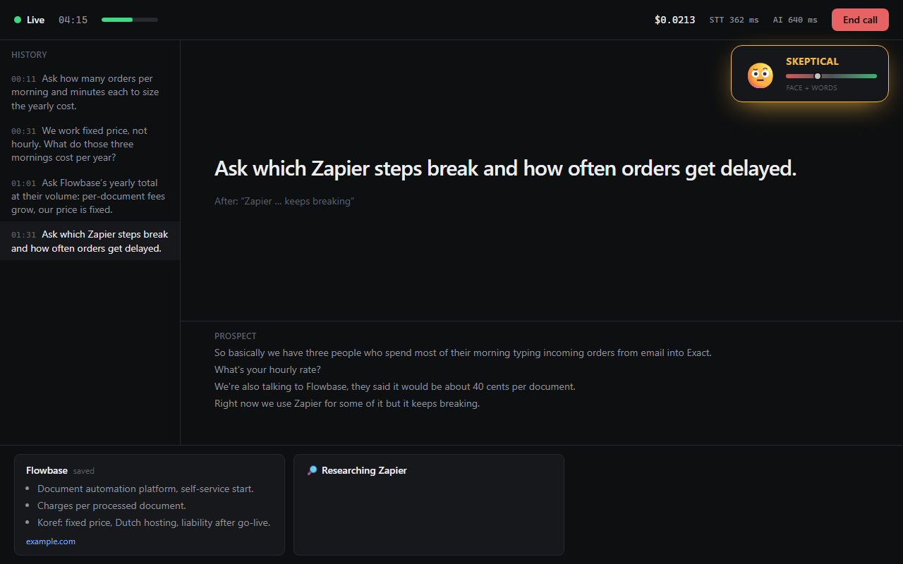
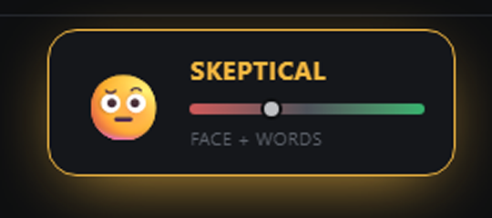
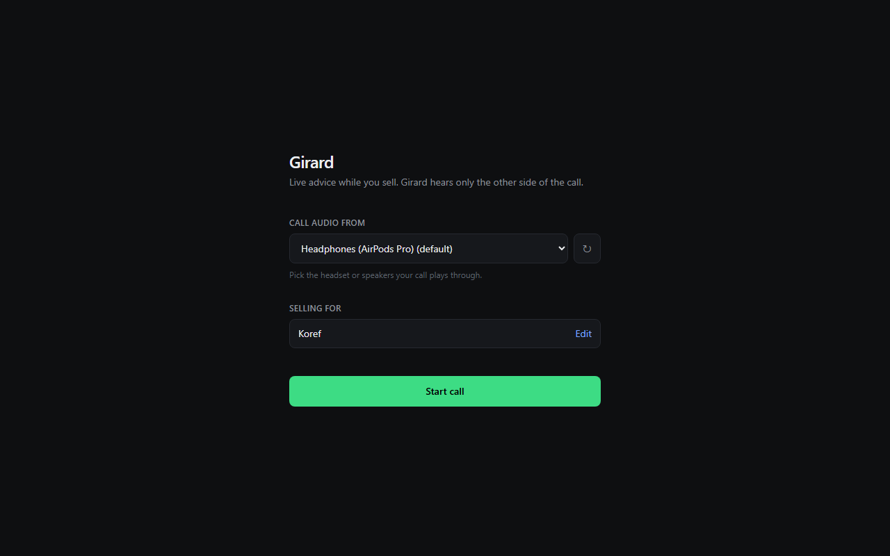

# Girard

**A live sales copilot that listens to your prospect and tells you what to say next.**

During a video or phone call, Girard hears the other side of the call, transcribes it on your own laptop and shows one short, tailored piece of advice a moment after the prospect stops talking. It researches every company they mention, reads their mood from their face and words, and when the call ends it saves a debrief as a Word file.



## Demo

<!-- Demo video: edit this file on github.com and drag the .mp4 onto the next line. GitHub turns it into a video player. -->
*Demo video coming soon.*

## Features

- **Advice in about half a second.** One point of 15 words or fewer, built from what the prospect actually said, your company's facts and everything said earlier in the call. It never invents prices, clients or results.
- **Hears only the prospect.** Girard records the output your call plays through, never your microphone.
- **Local speech-to-text.** Parakeet 0.6B runs on your CPU: about 0.2 s per chunk, 0.6% word errors in our benchmark, no audio leaves your laptop.
- **Smart filter.** Drops "yeah" and "mm-hmm", strips filler words, keeps questions, numbers and names, and fixes misheard company names ("Zap here" becomes Zapier).
- **Live company research.** When the prospect names a competitor or a tool they use, Girard looks it up with Tavily and shows three bullets with sources. Companies it has seen in the last 7 days show instantly.
- **Mood pop-up.** Reads the largest face on your screen and the prospect's words, fully local, and pops up their mood: positive, interested, neutral, skeptical, worried or annoyed.
- **Call memory.** Keeps track of budget, decision makers, pains and open objections in the background, so advice late in the call still connects to what was said early on.
- **Debrief as a Word file.** Summary, what went well, what to improve, needs, objections, next steps, stats and the full transcript. Nothing is stored unless you save it.
- **Your company, from your PDFs.** Drop in brochures or price lists and Girard builds the company context it advises from. You check and edit it before saving.
- **Live cost and speed.** The header shows what the call has cost in AI so far and how fast each part is.



## Requirements

- Windows 10 or 11
- 8 GB RAM (Girard itself uses about 1.6 GB during a call; no GPU needed)
- About 3 GB of free disk space
- [Node.js](https://nodejs.org/) 20 or newer
- [uv](https://docs.astral.sh/uv/) (Python package manager)
- API keys:
  - **Nebius Token Factory** (required): advice, call memory and debrief. Get one at [tokenfactory.nebius.com](https://tokenfactory.nebius.com).
  - **Tavily** (optional): company research. Get one at [app.tavily.com](https://app.tavily.com). Without it Girard works, just without research.

## Setup

1. Clone the repo:
   ```
   git clone https://github.com/r4q0/girard.git
   cd girard
   ```
2. Copy `.env.example` to `.env` and fill in your keys:
   ```
   NEBIUS_API_KEY=your-key
   TAVILY_API_KEY=your-key
   ```
3. Double-click **`Girard.bat`**.

The first start takes a few minutes: it installs the app and both Python engines and downloads the speech and mood models (about 850 MB). After that it starts in seconds.

## Using it



1. **Menu:** pick the headset or speakers your call plays through, check the company you sell for (**Edit** to change it or build it from PDFs), then **Start call**.
2. **During the call:** the latest advice sits in the middle. Earlier advice is on the left, and the arrow keys step through it. The prospect's words run below, research appears along the bottom and the mood pops up top right.
3. **After the call:** name it, **Save file** to get the Word debrief, then go **Back to menu**.

Mood from a face counts as emotion recognition under the EU AI Act: since 2 August 2026 you must tell the person you are analysing.

## How it works

| Part | What | Where |
| --- | --- | --- |
| Audio engine | Loopback capture of one output, silero voice detection that cuts at each pause or at 5 s, Parakeet 0.6B speech-to-text, and the line filter (about 0.35 ms per line) | `audio/` (Python, sherpa-onnx) |
| Mood engine | Screenshots of the whole screen 3 times a second; YuNet finds the largest face and HSEmotion reads it; a local RoBERTa model reads the words. Runs at low priority so it never slows the advice | `emotion/` (Python, onnxruntime, OpenCV) |
| App | Electron shell that starts both engines; advice, call memory, research summaries and debrief with GLM-5.2 on Nebius Token Factory; a local JSON store for research; Word export | `app/src/main/` (TypeScript) |
| Screens | Menu, company context, live call, end screen | `app/src/renderer/` (React, Tailwind) |
| Benchmarks | Model bake-off across all Nebius models, speech-to-text benchmark, advice style examples, filter check | `bench/` |

The path from the prospect to your screen: their voice is cut into chunks, Parakeet transcribes each one, the filter cleans it, and GLM-5.2 writes the advice. If GLM has not started answering within 650 ms, a second copy of the request is sent and the faster one wins. Every AI answer is cleaned of em dashes before it is shown or saved.

## Develop

```
cd app && npm run dev                 # app with hot reload
cd audio && uv run check_filter.py    # filter on sample lines
cd audio && uv run live_check.py      # audio engine on a test call played through your speakers
```

`GIRARD_SELFTEST=<seconds>` runs one call on the default output, logs advice, research, mood, stats and the debrief, saves a Word file to the temp folder and quits.

Screens can be checked in a browser with demo data: `node app/node_modules/vite/bin/vite.js --config app/vite.preview.config.ts`, then open `http://localhost:5174/?demo=call` (or `start`, `debrief`).

## License

Girard's code is released under the [MIT License](LICENSE).

The models it downloads at setup keep their own licenses:

| Model | Used for | License |
| --- | --- | --- |
| [Parakeet 0.6B](https://huggingface.co/nvidia) (NVIDIA, via sherpa-onnx) | Speech-to-text | [NVIDIA Open Model License](https://www.nvidia.com/en-us/agreements/enterprise-software/nvidia-open-model-license/) |
| [Silero VAD](https://github.com/snakers4/silero-vad) | Voice detection | MIT |
| [YuNet](https://github.com/opencv/opencv_zoo/tree/main/models/face_detection_yunet) | Face detection | MIT |
| [HSEmotion](https://github.com/HSE-asavchenko/face-emotion-recognition) | Face mood | Apache 2.0 |
| [RoBERTa GoEmotions](https://huggingface.co/SamLowe/roberta-base-go_emotions-onnx) | Mood from words | MIT |
